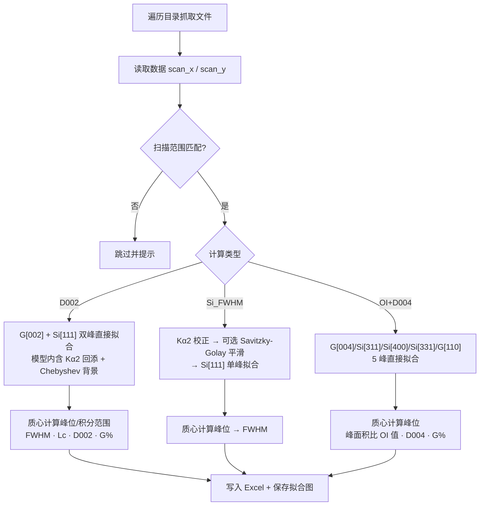

# Py-XRD-D002
## Introduction
XRD衍射数据自动分析
## Usage
运行 `main.py` 后按提示依次选择，程序会遍历当前目录（含子目录）下所有匹配的文件：

1. 选择文件类型
    1. `.rd` (Philips RD 文件，适用于 V3 设备，其余设备可能需要修改对应偏移量)
    2. `.xrdml` (帕纳科 XRD 文件，不同设备版本可能需要修改 `data_reader.py` 中对应 xml 元素)
    3. `.raw` (日本理学 XRD 文件)
2. 选择计算模块
    1. D002 (石墨 D002 —— 石墨[002] + 硅[111] 双峰)
    2. Si_FWHM (纳米硅 FWHM —— 硅[111] 单峰)
    3. OI+D004 (石墨 OI 值 —— [004]/[110] 强度比 + [004] 层间距)
3. 选择是否平滑数据（仅 Si_FWHM 模块询问，Savitzky-Golay 平滑后拟合）
    1. Yes
    2. No
4. 选择是否输出拟合结果（为每个样品生成独立 Excel 工作表与拟合图）
    1. Yes
    2. No
5. 选择是否裁切文件名（仅输出拟合结果时询问，取文件名倒数第 3 段作为工作表名）
    1. Yes
    2. No

程序会根据所选计算模块的峰位区间自动过滤扫描范围不匹配的文件（D002/Si_FWHM 需覆盖 26.5°–28.4°，OI+D004 需覆盖 54.5°–77°），不匹配的文件将被跳过并提示。全部处理完成后，结果汇总写入当前目录下的 `xrd_processed.xlsx`。

## Data Processing Flow
程序对每个匹配文件依次执行「读取 → 过滤 → 拟合 → 计算 → 输出」，整体流程如下：

### 1. 数据读取与范围过滤
- 按所选文件类型由 `data_reader.py` 解析为 2θ 角度数组 `scan_x` 与强度数组 `scan_y`（`.rd` / `.xrdml` / `.raw` 三种格式）。
- 程序按计算模块所需峰位区间过滤文件，范围不匹配的直接跳过并提示，避免不同扫描范围的数据混用导致拟合失败。

### 2. D002（石墨 [002] + 硅 [111] 内标双峰）
1. **直接拟合原始数据**：模型 `double_peak_raw` = 石墨 [002]（~26.5°）与硅 [111]（~28.4°）两个 Split-Pearson VII 峰 + 二阶 Chebyshev 背景，并在模型内部通过 `decorrect_ka2` 回添 Kα2 双线成分，因此无需预先校正即可拟合原始谱。
2. 由拟合参数重建各净峰曲线，用 IUCr 重心法（对称窗口内迭代质心）计算峰位及积分范围。
3. 以硅 [111] 内标校正峰位计算 D002 层间距：$d_{002}=\dfrac{\lambda}{2\sin\theta}$，其中 $\theta$ 为校正后石墨峰位的半角。
4. 石墨化度：$G\% = 100 \times \dfrac{3.440 - d_{002}}{3.440 - 3.354}$。
5. 半峰宽：
   - **实测值**：Split-Pearson VII 半峰宽数值求解；
   - **NET**：将硅峰与洛伦兹函数卷积拟合石墨峰进行反卷积，得到石墨净半峰宽；
   - **JIS**：按 JIS R 7651:2007 以硅 [111] 与石墨 [002] 半峰宽比值校正。
6. 由各 FWHM 按 Scherrer 公式计算 Lc 值。
7. 输出拟合结果时，用 `correct_ka2` 迭代法生成 Kα2 校正强度曲线用于绘图。

### 3. Si_FWHM（纳米硅 [111] 单峰）
1. 先用 `correct_ka2` 做迭代 Kα2 校正。
2. 可选 Savitzky-Golay（窗口 25、3 阶）平滑后再拟合。
3. 拟合 `single_peak`：硅 [111] Split-Pearson VII 峰 + Chebyshev 背景。
4. 重心法计算峰位，数值求解半峰宽 FWHM。

### 4. OI+D004（石墨 [004]/[110] 强度比 + 层间距）
1. **直接拟合原始数据**：模型 `oi_peak_raw` = 石墨 [004]（~54.2°）、硅 [311]（~56.1°）、硅 [400]（~69.1°）、硅 [331]（~76.4°）、石墨 [110]（~77.6°）五个 Split-Pearson VII 峰 + Chebyshev 背景，模型内含 Kα2 回添。
2. 重心法计算各峰位与积分范围；OI 值 = [004] 峰面积 / [110] 峰面积（梯形积分）。
3. 以硅 [311] 内标校正峰位计算 D004 层间距（$d_{004}=2 \times \dfrac{\lambda}{2\sin\theta}$），并换算石墨化度 G%。

### 5. 结果输出
- 汇总表 `Sample list` 写入 `xrd_processed.xlsx`；选择输出拟合结果时，另为每个样品创建独立工作表（原始强度、Kα2 校正强度、拟合曲线、背景及各净峰）。
- 在源文件同级目录保存 `{sample_name}_plot.png` 拟合图（含各分峰曲线与峰位质心标注线）。

## Output
输出文件 `xrd_processed.xlsx` 包含一个 `Sample list` 汇总表；选择输出拟合结果时，还会为每个样品创建独立的拟合结果工作表（原始强度、Kα2 校正强度、拟合曲线、背景及各分峰），并在源文件所在目录保存 `{sample_name}_plot.png` 拟合图。

### 石墨+硅内标样：测定石墨材料 D002 层间距

    1. D002 (Å) -- 石墨[002]层间距
    2. G% -- 石墨化度
    3. Graphite [002] Peak (deg) -- 石墨[002]峰位（拟合曲线质心）
    4. Graphite [002] Int. Range (deg) -- 石墨[002]质心积分范围
    5. Graphite [002] FWHM (deg) -- 石墨[002]半峰宽 (实测值)
    6. Silicon [111] Peak (deg) -- 硅[111]峰位（拟合曲线质心）
    7. Silicon [111] Int. Range (deg) -- 硅[111]质心积分范围
    8. Silicon [111] FWHM (deg) -- 硅[111]半峰宽 (实测值)
    9. Graphite [002] FWHM NET.(deg) -- 石墨[002]半峰宽 (反卷积数值计算)
    10.Graphite [002] Lc NET.(Å) -- 石墨[002]Lc值 (反卷积数值计算)
    11.Graphite [002] FWHM JIS(deg) -- 石墨[002]半峰宽 (依据JIS R 7651:2007)
    12.Graphite [002] Lc JIS(Å) -- 石墨[002]Lc值 (依据JIS R 7651:2007)

### 纳米硅：测定硅[111]晶向晶粒尺寸

    1. Silicon [111] Peak (deg) -- 硅[111]峰位（拟合曲线质心）
    2. Silicon [111] FWHM (deg) -- 硅[111]半峰宽 (实测值)

### 石墨：测定 OI 值（[004]强度/[110]强度）与 D004 层间距

    1. Graphite OI value (-) -- 石墨OI值(I004/I110)
    2. Dual D004 (Å) -- 石墨[004]层间距
    3. G% -- 石墨化度
    4. Graphite [004] Peak (deg) -- 石墨[004]峰位（拟合曲线质心）
    5. Graphite [004] Int. Range (deg) -- 石墨[004]质心积分范围
    6. Graphite [004] Intensity (counts) -- 石墨[004]峰强
    7. Graphite [004] FWHM (deg) -- 石墨[004]半峰宽
    8. Graphite [110] Peak (deg) -- 石墨[110]峰位（拟合曲线质心）
    9. Graphite [110] Int. Range (deg) -- 石墨[110]质心积分范围
    10.Graphite [110] Intensity (counts) -- 石墨[110]峰强
    11.Graphite [110] FWHM (deg) -- 石墨[110]半峰宽

## Project Structure
- `main.py` -- 程序入口：交互式选择、文件遍历与范围过滤、结果汇总与绘图
- `data_reader.py` -- 数据读取模块：`.rd` / `.xrdml` / `.raw` 三种格式解析
- `data_processor.py` -- 数据处理模块：Split-Pearson VII 分峰拟合、Kα2 校正、质心/FWHM/Lc 计算

## Credits
- 数据读取模块部分逻辑参考：[xylib](http://github.com/wojdyr/xylib/)
- 数据处理模块依赖于数值计算与数学库：[scipy](https://scipy.org/)、[numpy](https://numpy.org/)
- 数据可视化模块依赖于函数绘图库：[matplotlib](https://matplotlib.org/)
- 数据输出模块依赖于 excel 读写库：[openpyxl](https://openpyxl.readthedocs.io/)

## Reference
- [A Correction for the Alpha-1, Alpha-2 Doublet in tin Measurement of Width of X-ray Diffraction Lines](https://iopscience.iop.org/article/10.1088/0950-7671/25/7/125)
- [The Synthesis of X‐Ray Spectrometer Line Profiles with Application to Crystallite Size Measurements](https://doi.org/10.1063/1.1721595)
- [炭素材料の格子定数及び結晶子の大きさ測定方法 JIS R 7651:2007](https://kikakurui.com/r7/R7651-2007-01.html)
